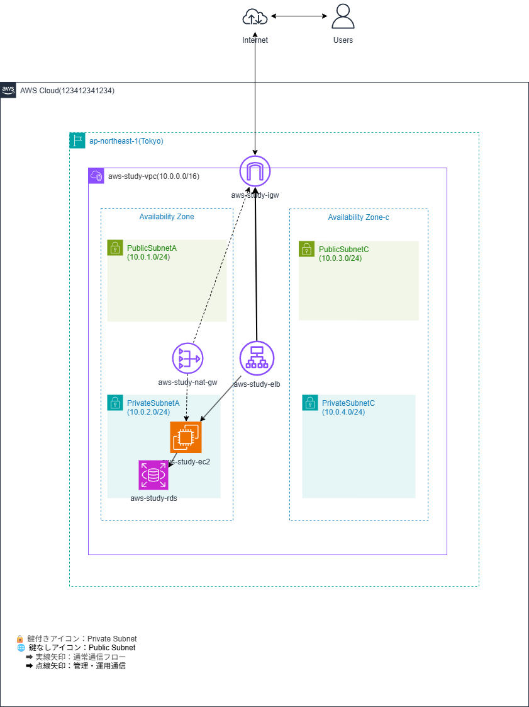
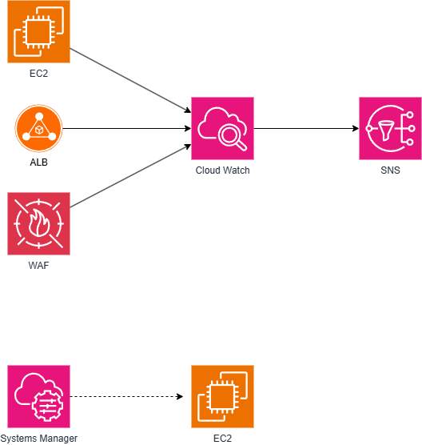

# AWS Infrastructure — Terraform IaC Project

## Overview

個人学習として、**本番環境を想定したAWSインフラをTerraformで構築**したプロジェクトです。
CloudFormationで設計した構成をTerraformへ移植することで、IaCツールの違いと使い分けを実践的に学習しました。

> **実際に `terraform apply` でAWSへデプロイ済み**の環境コードです。

---

## Architecture



### 構成の概要

| レイヤー | サービス | 設計意図 |
|----------|----------|----------|
| ネットワーク | VPC / IGW / NAT Gateway | パブリック/プライベートを分離しアクセス制御 |
| セキュリティ | AWS WAF | インターネットからの不正アクセスをIGW手前で遮断 |
| ロードバランサー | ALB | 複数AZへの振り分けで可用性を確保 |
| コンピュート | EC2 | プライベートサブネットに配置しセキュリティ強化 |
| データベース | RDS | 機密データを扱うためプライベートサブネットに隔離 |
| 運用アクセス | Systems Manager | SSM Session Manager経由でEC2へ安全にアクセス |
| 監視・通知 | CloudWatch / SNS | アラームと通知を連携し運用監視を自動化 |

---

### Subnet Design
VPC (10.0.0.0/16)

├── Public（aws-study-igw経由でインターネット接続）

│   ├── PublicSubnetA (10.0.1.0/24)   ALB / NAT Gateway

│   └── PublicSubnetC (10.0.3.0/24)   冗長化用

└── Private（NAT Gateway経由でのみ外部通信可能）

├── PrivateSubnetA (10.0.2.0/24)  EC2 / RDS

└── PrivateSubnetC (10.0.4.0/24)  冗長化用

PrivateSubnetはIGWへの直接ルートを持たず、NAT Gateway経由でのみ外部通信が可能です。
EC2へのアクセスはSSM Session Manager経由のみに限定しています。

---

## Why Terraform?

当初はCloudFormationで構成を設計しましたが、以下の理由からTerraformへ移植しました。

- **マルチクラウド対応**: Terraformは将来的にAzure/GCPへも応用可能
- **state管理**: 構成変更の差分（plan）を事前確認できる安全な運用フロー
- **コードの可読性**: HCLはYAMLより直感的でモジュール化しやすい

---

## Monitoring & Alerting Design

MSP運用を意識し、**障害を早期検知する仕組み**を構成に組み込みました。



- CloudWatch Alarm → SNS → Email通知 の連携
- EC2・RDS のメトリクス監視（CPU使用率など）

---

## What I Struggled With (実践で詰まったこと)

### Spring Boot の接続エラー
- **問題**: 設定ファイルのスペルミスと手順ミスで接続できない状態が続いた
- **解決**: エラーメッセージを分解し、設定値を1つずつ照合して原因を特定

### WAF・SNS の連携設定
- **問題**: AWSサービス間の連携設定（ARN参照・ポリシー設定）でエラーが頻発
- **解決**: AWSドキュメントとTerraformドキュメントを並行して読み、設定値の意味を理解してから修正

### 英語ドキュメントの読み方
- **問題**: エラーメッセージや公式ドキュメントが英語で、どこを見るべきか判断できなかった
- **対処**: AIを活用してエラーを翻訳・解釈しながら、ドキュメントの読み方自体を習得中

---

## Tech Stack

- **IaC**: Terraform (HCL)
- **Cloud**: AWS (Tokyo Region)
- **Monitoring**: Amazon CloudWatch / AWS CloudTrail / AWS Config
- **Security**: AWS WAF / AWS ACM / AWS Systems Manager
- **Diagram**: draw.io

---

## Repository Structure

```
.
├── terraform/          # Terraformコード一式
├── infrastructure.png  # アーキテクチャ図
├── infrastructure.drawio  # draw.ioソースファイル
└── README.md
```

---

## 今後の追加予定

- [ ] Terraformテスト（`.tftest.hcl`）の追加
- [ ] GitHub Actions による `terraform plan` の自動実行（CI）
- [ ] モジュール化によるコードの再利用性向上
- [ ] CloudTrail / AWS Config による監査・ガバナンス強化
